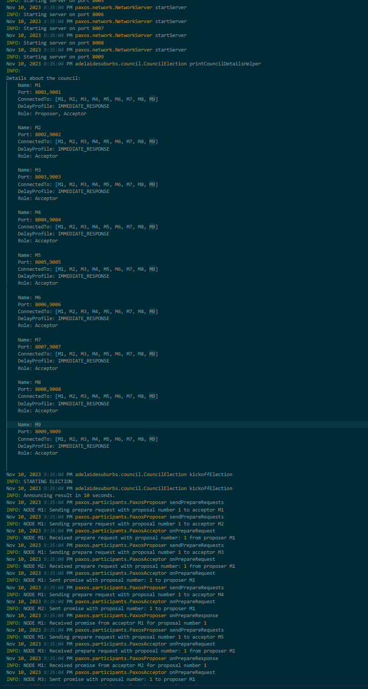
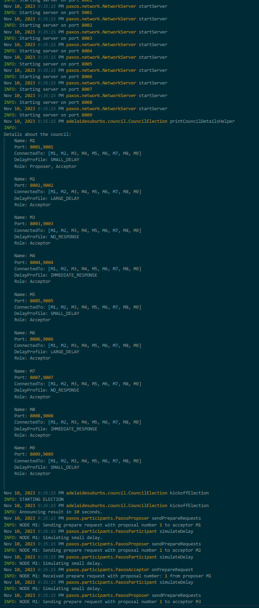
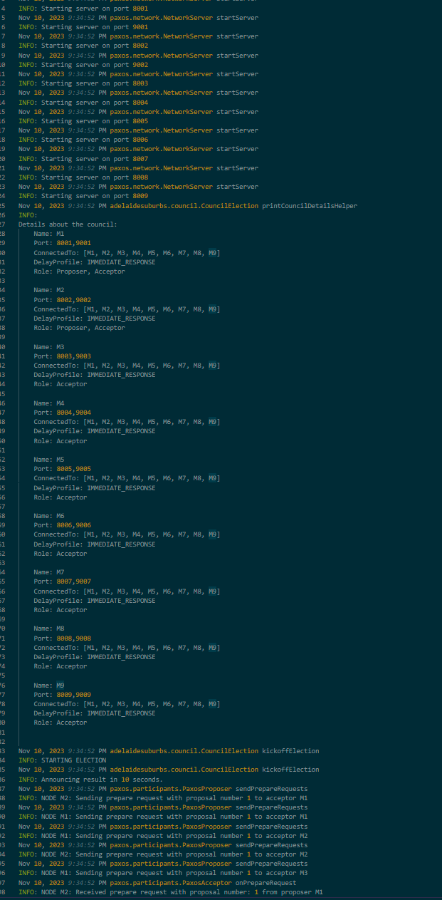
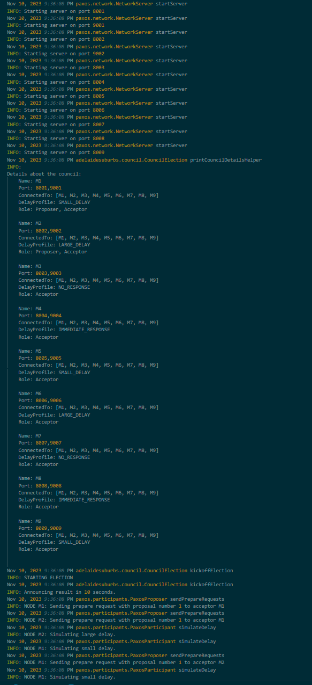

# Paxos Election System Testing Guide
## Introduction
This document outlines the integration tests conducted on the Paxos algorithm implementation within the Adelaide Suburbs Council Election system. The tests are designed to ensure the reliability and correctness of the Paxos protocol under various scenarios, particularly focusing on the election process involving multiple council members.

### Testing Tools & Frameworks:
- **JUnit:** For unit and integration testing of the Java codebase.
- **Java Util Logging:** To generate logs that can be analysed post-test for any unexpected behavior.

## Test Scenarios
### Unit Tests:
`PaxosProposer` 
- Test the initialization of proposals.
- Test response handling when receiving promises.
- Test response handling when receiving accepted messages.

`PaxosAcceptor` 
- Test promise generation upon receiving a proposal.
- Test the handling of multiple simultaneous proposals.
- Test accept message generation.

`PaxosLearner` 
- Test the tallying of accepted messages.
- Test consensus achievement notification.

`PaxosMessage & PaxosMessageQueue` 
- Test message creation and types.
- Test thread-safe exchange of messages between participants.

### Integration Tests:
The integration tests cover four primary scenarios:

**1. Immediate Response with One Proposer** 
**2. Various Delay Responses with One Proposer** 
**3. Two Proposers Proposing Concurrently** 
**4. Two Proposers with Various Delays** 

`1. Immediate Response with One Proposer` 
- **Objective:** Validate the election process when one council member proposes and all members (including proposer) respond immediately.
- **Log File:** testImmediateResponseOneProposer.log 
 
**Logfile link:** https://github.com/lenny2many/DS-A3/tree/main/logs/testImmediateResponseOneProposer.log

`2. Various Delay Responses with One Proposer` 
- **Objective:**: Assess the system's behavior when one council member proposes and other members respond with varying delays.
- **Log File:** testVariousDelaysOneProposer.log 
 
**Logfile link:** https://github.com/lenny2many/DS-A3/tree/main/src/main/logs/testVariousDelaysOneProposer.log

`3. Two Proposers Proposing Concurrently` 
- **Objective:**: Test the system's stability and correctness when two proposers initiate the election process simultaneously under immediate response conditions.
- **Log File:** testTwoProposersConcurrent.log 
 
**Logfile link:** https://github.com/lenny2many/DS-A3/tree/main/src/main/logs/testTwoProposersConcurrent.log

`4. Two Proposers with Various Delays` 
- **Objective:**: Evaluate the system's performance and conflict resolution when two proposers initiate the election process simultaneously, with other members responding with various delays.
- **Log File:** testTwoProposersConcurrentVariousDelays.log 
 
**Logfile link:** https://github.com/lenny2many/DS-A3/tree/main/src/main/logs/testTwoProposersConcurrentVariousDelays.log

### To re-run the integration tests and get the exact same results. use the following command (refer to README.md in root to learn about makefile): 
- `make test_paxos_integration`